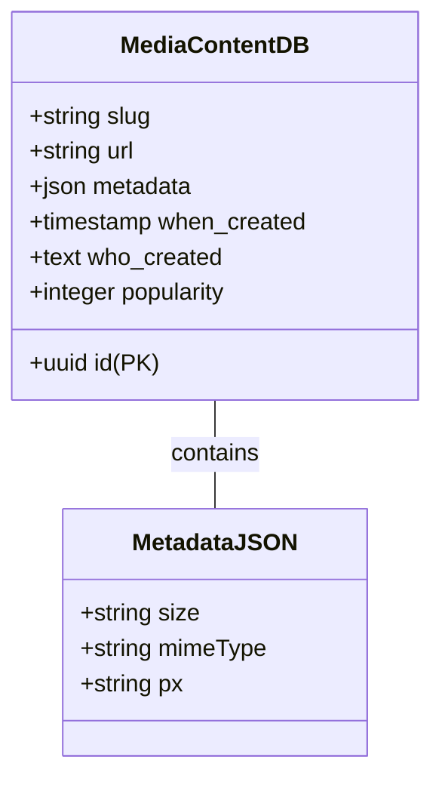
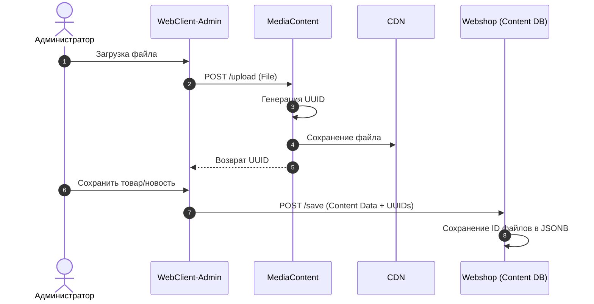
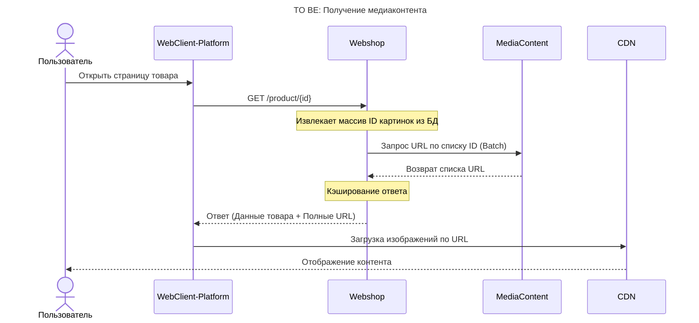

# Микросервис для централизованного управления медиафайлами

## Проблематика

*   **Используем ImageGroup:** хранится в Redis, сложная реализация. Для добавления нового типа изображений нужно добавить новую `ImageGroup` и настроить загрузку/получение медиафайлов из нее на Frontend.
*   **Кэширование:** Медиафайл сохраняем с тем же идентификатором, что и товар/новость/баннер и т.д. Это усложняет замену изображений (проблема с инвалидацией кэша).
*   **Сложная архитектура:** Для отображения медиафайлов пользователю Frontend отправляет несколько запросов в разные микросервисы, консолидирует полученную информацию и уже с ней идет на CDN.
*   **Лишние запросы:** Идентификатор медиафайла храним в Content, хотя он идентичен идентификатору товара/новости/баннера.
*   **Разные подходы к оперированию и хранению идентификаторов:**
    *   *Товары:* текущая реализация.
    *   *Карусель на Главной:* BASE хранит в БД микросервиса (`jsonb`) ссылки на CDN (без хоста и бакета), изображения на CDN загружаем руками.
    *   *Новости:* может хранить идентификаторы/ссылки на CDN в своей БД (`jsonb`), нужна новая `ImageGroup` для загрузки изображений в Админке.
    *   *Изображения проектов:* не реализовано.

## Цель

1.  Решить проблему с заменой/обновлением изображений.
2.  Выработать единый масштабируемый подход к оперированию и хранению медиафайлов.
3.  Упростить схему получения Фронтендом пути до изображения на CDN.

---

## Целевое решение

> [!NOTE]
> `Media` ≠ `MediaContent` `Content` ≠ `MediaContent`

Разработать новый микросервис **MediaContent** для централизованного управления медиафайлами.

**Основные задачи:**
*   Загрузка, замена и удаление медиафайлов на CDN, хранение идентификаторов медиафайлов.
*   Хранение метаданных (размер, тип, разрешение).
*   Генерация уникальных идентификаторов медиафайлов (отличный от идентификатора соответствующего контента).
*   Генерация URL для доступа через CDN (без хоста и бакета).

Микросервис `MediaContent` должен иметь свою БД, а также **shared-библиотеку** для интеграции с микросервисами, использующими медиафайлы.

### Структура БД

#### Таблица `media_files`

| Поле | Тип | Описание |
| :--- | :--- | :--- |
| **id** | `uuid` | **PK**. Уникальный идентификатор файла. Генерируется сервисом `MediaContent`, не связан с ID контента. |
| **slug** | `string` | *(Опционально)* Человекочитаемый идентификатор (например, тип контента: товар, новость). |
| **url** | `string` | Относительный путь к файлу в хранилище (например, `images/rq/news/image.jpg`). Базовый хост CDN в конфиге. |
| **metadata**| `json` | Дополнительные данные: размер, MIME-тип, разрешение. |
| **when_created**| `timestamp`| *(Опц)* Дата и время загрузки. |
| **who_created** | `text` | *(Опц)* ID пользователя админки, загрузившего файл. |
| **popularity** | `integer` | *(Опц)* Количество запросов (для очистки неиспользуемых). Сбрасывается раз в месяц. |

### Пример данных

**Таблица в MediaContent:**

| id (uuid) | slug | url | metadata |
| :--- | :--- | :--- | :--- |
| `00002afb-846e...` | `news` | `video/rq/news/00002afb...avi` | `{"size":"100MB", "mimeType":"video/avi"...}` |
| `0001dfed-3f44...` | `product` | `images/mk/products/0001dfed...jpg` | `{"size":"10KB", "px":"500x500"...}` |

---

## Интеграция с другими микросервисами

Для интеграции необходимо написать **shared-библиотеку**, которая будет ходить в микросервис `MediaContent`.

Связь контента (товара/новости) с медиафайлами осуществляется через хранение идентификаторов в БД микросервисов контента (`Shop`, `News`, `Games`).

### Пример интеграции (с News)

В таблице сущности (например, `products` или `news`) создается поле `images` типа `jsonb` (или массив), где хранится список ID файлов из `MediaContent`.

**Таблица БД News:**

| id (uuid) | service_id | images (jsonb) |
| :--- | :--- | :--- |
| `0fd1f567...` | `rq` | `{"00002afb-846e...", "20011azxr-555e..."}` |
| `37654c56...` | `mk` | `{"0674dfyt-3f44..."}` |

---

## Процессы (Data Flow)

### 1. Запись и обновление медиа в Админке

Процесс TO BE будет схож с AS IS.

1.  При загрузке медиафайла (создание/редактирование) `Webclient-Admin` отправляет POST-запрос в `MediaContent`.
2.  `MediaContent` генерирует `uuid`, сохраняет файл на CDN.
3.  `MediaContent` возвращает `uuid` в `Webclient-Admin`.
4.  При сохранении товара `Webclient-Admin` отправляет POST-запрос в микросервис контента (`Webshop`), передавая `uuid` медиафайла.

### 2. Отображение пользователю (Сравнение)

#### AS IS (Текущая реализация)
Очень сложный флоу: `Webclient` -> `Media` -> `Webshop` -> `Localizator` -> `Regions` -> Возврат данных -> `Webclient` собирает ссылку на CDN из `ImageGroup`.

#### TO BE (Целевое решение)
Упрощенная схема с обогащением данных на бэкенде.

1.  Пользователь открывает страницу.
2.  `Webclient` запрашивает товар у `Webshop`.
3.  `Webshop` извлекает массив ID изображений из своей БД.
4.  `Webshop` обращается в `MediaContent` (через shared-lib), чтобы "обогатить" данные — получить полные URL по списку ID.
5.  Ответ от `MediaContent` кэшируется на стороне `Webshop`.
6.  `Webshop` возвращает на фронт полные данные с готовыми ссылками.

---

## Необходимые эндпоинты

### Public API (для микросервисов)
*   **Отображение на платформе**
    *   Input: `Payload: [uuid, uuid, ...]` (массив ID)
    *   Output: `Response: ["url1", "url2", ...]` (ссылки на CDN)

### Admin API
*   **Отображение в админке**
    *   Input: `Payload: [uuid, ...]`
    *   Output: `Response: ["url1", ...]`
*   **Сохранение медиафайла**
    *   Input: `Payload: File` (сам файл)
    *   Output: `Response: uuid`

---

## Оценка реализации

### Верхнеуровневая оценка
*   **Backend:** 20-30 sp (4-6 недель)
*   **Frontend:** 10 sp (2 недели)

### Детализация задач
**Backend:**
1.  Разработать новый микросервис со своей БД.
2.  Написать shared-библиотеку для интеграции.
3.  Реализовать интеграцию с сервисами (`Webshop`, `NewsV2`, `ContentForge`, `GameInfo`).
4.  *(Опционально)* Job для автоматической очистки CDN и БД (если реализуем `popularity`).

**Frontend:**
1.  Актуализировать флоу/логику загрузки, обновления, получения, удаления медиафайлов (на платформе и в админке).

---

## Дальнейшее развитие

*   Подключение к новым/разрабатываемым контентным микросервисам (масштабируемость).
*   При глобальной переработке архитектуры платформы возможна реализация единого подхода к динамическому контенту и доступности (`Localizator` и `Regions`).

---

### Основание решения
*Решение будет принято на tech kick-off 30 июл. 2025 г.*
