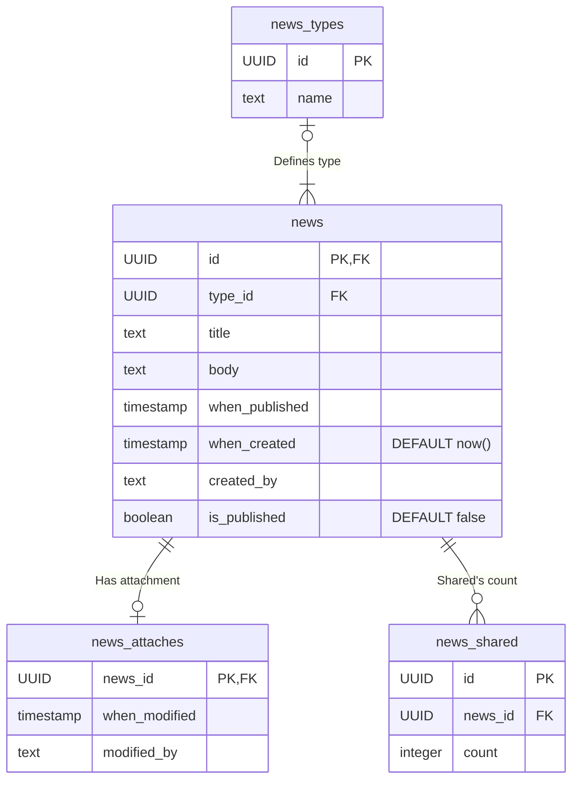

# Микросервис новостей

## Общая информация

### Задача микросервиса
Создание, публикация, хранение и отображение пользователю релевантных для его региона новостей на его языке.

### Задействован в процессах
*   Отображение новостей пользователю
*   Создание, публикация и закрепление новостей в Admin-Panel

### Логирование событий
**Kafka**
* Producer:
   * NewsAddedEvent
   * NewsPublishedEvent
* Consumer:
   * UserSharedNewsEvent

---

## База данных


База данных микросервиса News содержит таблицы:

*   **news** - хранит основные данные новости (идентификатор, проект, тип новости, заголовок, тело новости и дату публикации и т. д.)
*   **news_attaches** - хранит данные о закреплении новостей в ленте
*   **news_types** - справочник типов новостей
*   **news_shared** - хранит данные о том, сколько раз делились новостями

### Состав таблиц

#### Таблица "news"
> основные данные новости

| Ключ | Параметр | Тип | Описание | Дополнительная информация |
| :--- | :--- | :--- | :--- | :--- |
| Первичный, Внешний | **id** | UUID | Идентификатор новости | UNIQUE,<br>NOT NULL |
| Внешний | **type_id** | UUID | Идентификатор типа новости (из таблицы news_types) | NOT NULL |
| | **title** | text | Заголовок новости | NOT NULL |
| | **body** | text | Тело новости | |
| | **when_published** | timestamp | Когда опубликована | |
| | **is_published** | boolean (true/false) | Признак того, опубликована новость или нет | NOT NULL<br>DEFAULT - `false` |
| | **when_created** | timestamp | Когда создана | NOT NULL<br>DEFAULT - `NOW()` |
| | **created_by** | text | Кем создана | NOT NULL |

#### Таблица "news_attaches"
> данные о закреплении новостей в ленте

| Ключ | Параметр | Тип | Описание | Дополнительная информация |
| :--- | :--- | :--- | :--- | :--- |
| Первичный,<br>Внешний | **news_id** | UUID | Идентификатор новости | UNIQUE,<br>NOT NULL |
|  | **when_modified** | timestamp | Когда изменен прикнак закрепления новости |  |
| | **modified_by** | text | Кем прикреплена/откреплена |  |

#### Таблица "news_types"
> типы новостей

| Ключ | Параметр | Тип | Описание | Дополнительная информация |
| :--- | :--- | :--- | :--- | :--- |
| Первичный | **id** | UUID | Идентификатор типа новостей | UNIQUE,<br>NOT NULL |
| | **name** | text | Наименование типа новостей | UNIQUE,<br>NOT NULL |

#### Таблица "news_shared"
> результаты подсчета событий `UserSharedNewsEvent`

| Ключ | Параметр | Тип | Описание | Дополнительная информация |
| :--- | :--- | :--- | :--- | :--- |
| Первичный | **id** | UUID | Идентификатор события | UNIQUE,<br>NOT NULL |
| Внешний | **news_id** | UUID | Идентификатор новости | NOT NULL |
| | **count** | integer | Количество событий "Поделиться" для конкретной новости | NOT NULL |

### Взаимосвязь таблиц

*   **news** (`id`) — **news_attaches** (`news_id`)
    *   *"один к одному или нулю"*
    *   Связывает общие данные новости (по `id`) с признаком ее закрепленности в ленте новостей (по `news_id`).
*   **news** (`type_id`) —  **news_types** (`type_id`)
    *   *"многие к одному или нулю"*
    *   Получает тип конкретной новости (по `type_id`) из библиотеки типов новостей (по `id`).<br>Может существовать тип, с которым еще не опубликованы новости.
 *  **news** (`id`) —  **news_shared** (`news_id`)
    *   *"один ко многим или нулю"*
    *   Связывает новость (по `id`) с тем, сколько раз ею поделились (по `news_id`).

#### ER-диаграмма



---

### Примеры запросов
Далее приведен пример запроса в БД, который собирает ленту из 50 самых поппулярных новостей, отображая их заголовок, краткий анонс, текущий статус («ЗАКРЕПЛЕННАЯ», «НОВАЯ» или «ПРОЧИЕ») и поппулярность.
Результат отсортирован так, чтобы показать самые частопересылаемые пользователями новости в каждой категории (категории сортируются не по названию, а по количеству опубликованных в них новостей).

#### SQL

``` SQL

WITH Категории AS (                                                   // Считаем количество опубликованных новостей в каждой категории
    SELECT
        type_id,
        COUNT(*) AS total_count,
        MAX(when_published)
    FROM public.news n
    WHERE is_published = TRUE
    GROUP BY type_id
    HAVING COUNT(*) > 0 
)
SELECT
    n.id AS news,
    n.title,
    COALESCE(LEFT(n.body, 200) || '...', 'Нет содержания') AS preview,    // Сокращаем содержимое новости до краткого содержания (первые 200 символов и ...)
    EXTRACT(DAY FROM (NOW() - n.when_published)) AS days_since_pub,       // Считаем сколько дней новость уже опубликована
    CASE                                                                  // Определяем статус новостей («ЗАКРЕПЛЕННАЯ», «НОВАЯ» или «ПРОЧИЕ»)
        WHEN na.news_id IS NOT NULL THEN 'ЗАКРЕПЛЕННАЯ'
        WHEN n.when_published > (NOW() - INTERVAL '3 days') THEN 'НОВАЯ'
        ELSE 'ПРОЧИЕ'
    END AS status,
    ROW_NUMBER() OVER (                                                   // Присваиваем "места" в зависимости от количества пересылаемости новости
        PARTITION BY ns.count 
        ORDER BY ns.count DESC
    ) AS rank,

    Категории.total_count AS category_size

FROM public.news n 
INNER JOIN news_types nt ON n.type_id = nt.id                             // Соединяем таблицы
INNER JOIN Категории ON n.type_id = Категории.type_id
INNER JOIN news_shareds ns ON n.id = ns.news_id
LEFT JOIN news_attaches na ON n.id = na.news_id

WHERE
    n.is_published = TRUE                                                 // Смотрим только опубликованные новости

ORDER BY                                                                  // Сортируем по поппулярности, "размерам" категории и новизны новостей
	rank ASC,
	category_size DESC,
   days_since_pub DESC

LIMIT 50 OFFSET 0;                                                        // Смотрим полученные записи от 1 до 50 (не пропуская ничего)

```

#### 1С

```Bsl
// 1. Создаем временную таблицу
ВЫБРАТЬ
	News.type_id КАК ТипНовости,
	КОЛИЧЕСТВО(News.Ссылка) КАК КолвоН
ПОМЕСТИТЬ ВТ_Категории
ИЗ
	Справочник.News КАК News
ГДЕ
	News.is_published = ИСТИНА
СГРУППИРОВАТЬ ПО
	News.type_id
ИМЕЮЩИЕ
	КОЛИЧЕСТВО(News.Ссылка) > 0
;

// 2. Основной запрос
ВЫБРАТЬ ПЕРВЫЕ 50
	News.Ссылка КАК News,
	News.title КАК ЗаголовокНовости,
	ЕСТЬNULL(ПОДСТРОКА(News.body, 1, 200) + "...", "Нет содержания") КАК КраткоеОписание,
	РАЗНОСТЬДАТ(News.when_published, &ТекущаяДата, ДЕНЬ) КАК СколькоДнейСПубликации,
	ВЫБОР
		КОГДА НЕ NewsAttaches.news_id ЕСТЬ NULL
			ТОГДА "ЗАКРЕПЛЕННАЯ"
		КОГДА РАЗНОСТЬДАТ(News.when_published, &ТекущаяДата, ДЕНЬ) <= 3
			ТОГДА "НОВАЯ"
		ИНАЧЕ "ПРОЧИЕ"
	КОНЕЦ КАК СтатусНовости,

	(ВЫБРАТЬ
		КОЛИЧЕСТВО(СобытияПоделиться.news_id) + 1
	ИЗ
		РегистрСведений.NewsShareds КАК СобытияПоделиться
	ГДЕ
		СобытияПоделиться.count = NewsShareds.count
		И СобытияПоделиться.news_id < News.Ссылка) КАК МестоВРейтинге,

	Категории.КолвоН КАК РазмерКатегории

ИЗ
	Справочник.News КАК News
		ВНУТРЕННЕЕ СОЕДИНЕНИЕ Справочник.NewsTypes КАК NewsTypes
		ПО News.type_id = NewsTypes.Ссылка
		ВНУТРЕННЕЕ СОЕДИНЕНИЕ ВТ_Категории КАК Категории
		ПО News.type_id = Категории.ТипНовости
		ВНУТРЕННЕЕ СОЕДИНЕНИЕ РегистрСведений.NewsShareds КАК NewsShareds
		ПО News.Ссылка = NewsShareds.news_id
		ЛЕВОЕ СОЕДИНЕНИЕ РегистрСведений.NewsAttaches КАК NewsAttaches
		ПО News.Ссылка = NewsAttaches.news_id

ГДЕ
	News.is_published = ИСТИНА

УПОРЯДОЧИТЬ ПО
	МестоВРейтинге ВОЗР,
	РазмерКатегории УБЫВ,
	СколькоДнейСПубликации УБЫВ

```

