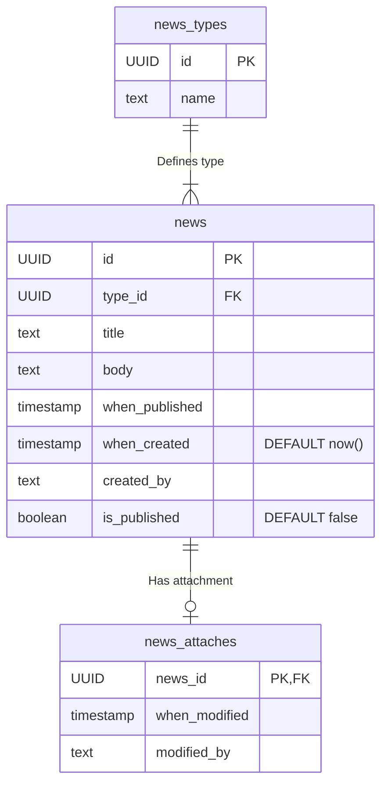

# Описание микросервиса новостей

## Общая информация

### Задача микросервиса
Создание, публикация, хранение и отображение пользователю релевантных для его региона новостей на его языке.

### Задействован в процессах
*   Отображение новостей пользователю (_ссылка на HLA_)
*   Создание новостей в админке (_ссылка на HLA_)
*   _и т.д._

### Логирование событий
**Producer:** нет

**Consumer:**
*   Kafka _topic Name1_
*   Kafka _topic Name2_

---

## Схема взаимодействия

---

## База данных

База данных микросервиса News содержит таблицы:

*   **news** - хранит основные данные новости (идентификатор, проект, тип новости, заголовок, тело новости и дату публикации и т. д.)
*   **news_attaches** - хранит данные о закреплении новостей в ленте
*   **news_types** - справочник типов новостей

### Взаимосвязь таблиц

*   **news** (`id`) — **news_attaches** (`news_id`)
    *   *"один к одному или нулю"*
    *   Связывает общие данные новости (по `id`) с признаком ее закрепленности в ленте новостей (по `news_id`).
*   **news** (`type_id`) —  **news_types** (`type_id`)
    *   *"один ко многим" (reverse)*
    *   Получает тип конкретной новости (по `type_id`) из библиотеки типов новостей (по `id`).

#### ER-диаграмма

---

## Сущности таблиц

### Таблица "news"

| Ключ | Параметр | Тип | Описание | Дополнительная информация |
| :--- | :--- | :--- | :--- | :--- |
| Первичный | **id** | UUID | идентификатор новости | Не может быть пустым (NOT NULL) |
| Внешний | **type_id** | UUID | идентификатор типа новости (из таблицы news_types) | Не может быть пустым (NOT NULL) |
| | **title** | text | заголовок новости | Не может быть пустым (NOT NULL) |
| | **body** | text | тело новости | |
| | **when_published** | timestamp | Когда опубликована | |
| | **is_published** | boolean (true/false) | Признак того, опубликована новость или нет | Не может быть пустым (NOT NULL) По умолчанию - `false` |
| | **when_created** | timestamp | Когда создана | Не может быть пустым (NOT NULL) По умолчанию - `NOW()` |
| | **created_by** | text | Кем создана | Не может быть пустым (NOT NULL) |

_и т.д._

---

## Спецификация API

Описание контрактов см. _по ссылке_.
