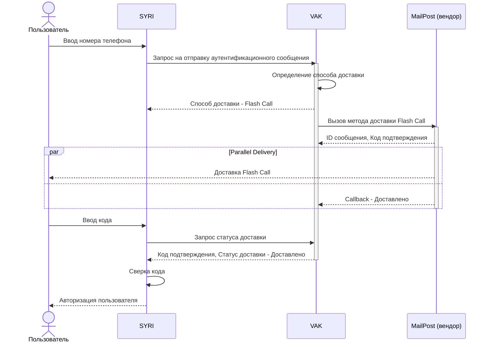

# Software Requirements Specification

## 1. Введение

### 1.1. Цель и область применения документа
Данный документ описывает разрабатываемую систему VAK (далее - Система), а также ограничения, налагаемые на архитекторов и разработчиков, функциональные, нефункциональные и интеграционные требования на этапе MVP.

### 1.2. История изменений документа

| Автор | Версия документа* | Описание изменений | Дата внесения изменений |
| :--- | :--- | :--- | :--- |
| Viktoriya Kovaleva | V 1.0 | Создана первая версия документа | 13 янв. 2025 г. |
| Viktoriya Kovaleva | V 1.1 | Добавлены перекрестные ссылки в документ | 23 янв. 2025 г. |
| Viktoriya Kovaleva | V 2.0 | Пакет документов скорректирован в соответствии с изменением MVP, добавлена спецификация API | 4 февр. 2025 г. |

> **Версия документа:**
> 
> При внесении в документ изменений, которые меняют его основную суть или важные постулаты меняется первая цифра версии: V 1.0 -> V 2.0 
> При внесении незначительных корректировок, исправления опечаток, уточнения корректировок меняется вторая цифра версии: V 1.1 -> V 1.2

### 1.3. Глоссарий
Все термины и определения, а также описание систем и аббревиатур приведены в [Glossary](glossary.md).

---

## Содержание:
1. [Введение](#1-введение)
2. [Общая информация](#2-общая-информация)
3. [Правила и ограничения](#3-правила-и-ограничения) 
    3.1. [Ограничения дизайна и реализации](#31-ограничения-дизайна-и-реализации) 
    3.2. [Предположения и зависимости](#32-предположения-и-зависимости) 
4. [Требования к системе](#4-требования-к-системе) 
    4.1. [Функциональные требования](#41-функциональные-требования) 
    4.2. [Use Cases](#42-use-cases) 
    4.3. [Требования к пользовательскому интерфейсу](#43-требования-к-пользовательскому-интерфейсу) 
    4.4. [Нефункциональные требования](#44-функциональные-требования) 
    4.5. [Требования к мониторингу стабильности системы](#45-требования-к-мониторингу-стабильности-системы) 
    4.6. [Требований к тестированию](#46-требования-к-тестированию) 
    4.7. [Интеграционные требования](#47-интеграционные-требования)

---

## 2. Общая информация

### 2.1. Назначение системы
VAK позволит сервисам компании отправлять аутентификационные сообщения пользователям платформы на номера мобильных телефонов посредством альтернативных (более дешевых) методов доставки, чем SMS.
VAK на этапе MVP не отправляет самостоятельно SMS.

### 2.2. Цели системы
VAK разрабатывается для достижения следующих целей:
1.  Подключение альтернативных SMS способов доставки аутентификационных сообщений пользователям по номеру телефона;
2.  Подключение новых/дополнительных вендоров доставки аутентификационных сообщений пользователям;
3.  Постепенная замена WGNC.

Подробное описание проекта доступно в [Vision & Scope](vision-and-scope.md), в рамках которого в разделе «Масштабы и ограничения проекта» перечислены функции, которые запланированы для полной или частичной реализации в релизах.

### 2.3. Основные функции системы
Основные функции Системы зафиксированы в [Vision & Scope](vision-and-scope.md).
Реализуемые в рамках MVP функции Системы:

| ID | Описание |
| :--- | :--- |
| ОФ-2 | Отправка аутентификационных сообщений пользователям посредством Flash Call |
| ОФ-3 | Определение способа доставки аутентификационных сообщений в зависимости от кода страны в номере телефона пользователя |

> [!Note]
>
> На этапе MVP осознанно реализуется упрощенный функционал, так как информации по другим вендорам на данный момент нет, а также у проекта сильно ограничены сроки реализации.
> Все взаимодействия с новыми/потенциальными вендорами будут прорабатываться в требованиях к Scope 1 проекта VAK.

---

## 3. Правила и ограничения

### 3.1. Ограничения дизайна и реализации
**Design and Implementation Constraints**

В данном разделе описаны ограничения (О), налагаемые на архитекторов и разработчиков, включая:
*   обязательные технологии, языки программирования или базы данных;
*   ограничения, налагаемые операционной средой;
*   ограничения, связанные с оборудованием (требования к памяти, размер и пр.).

| ID | Описание |
| :--- | :--- |
| О-1 | Выбранные инструменты, методики, паттерны и пр., не описанные в нижеприведенных ограничениях, должны быть согласованы Архитектурным комитетом компании |
| О-2 | Должна быть предусмотрена возможность хранить информацию, содержащую персональные данные пользователей, на разных геораспределенных серверах в зависимости от региона пользователя для выполнения законодательства разных стран (при наличии такового) |
| О-3 | Для контейнеризации приложения необходимо использовать Docker |
| О-4 | Для управления контейнерами приложения необходимо использовать Kubernetes |
| О-5 | Для баз данных необходимо использовать PostgreSQL 17 версии (использование версии выше 17 должно быть согласовано на Архитектурном комитете) |
| О-6 | В качестве брокера сообщений необходимо использовать Kafka |
| О-7 | Для реализации кэширования необходимо использовать Redis |
| О-8 | Для логирования необходимо использовать ElasticSearch |
| О-9 | Для отслеживания ошибок и исключений необходимо использовать Sentry |
| О-10 | Для мониторинга необходимо использовать Prometheus |
| О-11 | Для CI/CD необходимо использовать Jenkins |
| О-12 | Для хранения логинов и паролей для доступа к системе и вендорам необходимо использовать Vault |
| О-13 | Система должна подключаться к локальной сети компании, доступ из интернета должен быть ограничен посредством Wallarm |

### 3.2. Предположения и зависимости

#### 3.2.1. Предположения
В данном разделе описаны допущения (Д), на которых основываются границы проекта.

| ID | Описание |
| :--- | :--- |
| Д-2 | Функция ОФ-2 (Flash Call) требует, чтобы телефон пользователя имел стабильное голосовое соединение, работающий определитель номера и не был в режиме «Не беспокоить». Система (VAK) не гарантирует доставку, если: • Телефон пользователя находится вне зоны действия сети. • Пользователь настроил блокировку скрытых или незнакомых номеров. |
| Д-3 | Система не несет ответственности за неполучение пользователем аутентификационного сообщения, вызванное действиями пользователя, включая ввод неверного номера телефона |
| Д-4 | Работа Системы напрямую зависит от доступности и стабильности вендоров и внешних провайдеров. Система (VAK) не является источником сбоев, вызванных: • Полной или частичной недоступностью API вендора. • Изменением API или форматов запросов/ответов со стороны вендора без предварительного уведомления. • Введением вендором/провайдером новых лимитов или ограничений. |
| Д-5 | Функция определения способа доставки аутентификационного сообщения по стране ограничена реальным географическим покрытием, предоставляемым провайдерами. Система не может предоставить тот или иной способ доставки для страны, в которой текущие провайдеры не оказывают соответствующие услуги |
| Д-6 | Алгоритм определения страны по номеру телефона может быть неточным для: • Виртуальных номеров (VoIP). • Номеров, не соответствующих международному формату E.164. • Новых, недавно введенных в эксплуатацию кодов стран. |
| Д-7 | Несмотря на реализацию каскадной отправки, Система не гарантирует 100% доставку аутентификационного сообщения. Существуют сценарии, при которых все способы доставки могут оказаться недоступными по причинам, не зависящим от Системы |
| Д-8 | Время жизни кода подтверждения, генерируемого на стороне провайдера, определяется провайдером и не может быть изменено в одностороннем порядке |

#### 3.2.2. Зависимости
Зависимость Системы от других сервисов/проектов приведена в п. 3.3 [Vision & Scope](vision-and-scope.md).
Сроки выполнения задач смежными сервисами/проектами приведены в *Combined roadmap*.

---

## 4. Требования к системе

### 4.1. Функциональные требования
В данном разделе описаны требования к функциональности (ФТ) и поведение проектируемой системы VAK в определенных условиях (Use Cases).
В данном разделе указаны только операции, которые выполняет непосредственно VAK (в отсутствии интеграции с другими сервисами и вендорами).
Операции, выполняемые в рамках интеграции с другими сервисами, описаны в п. 4.6.

#### 4.1.1. Выполняемые системой функции

| ID | Описание | Use Case |
| :--- | :--- | :--- |
| ФТ-1.1 | Система должна определять код страны по полученному номеру телефона | UC-02 |
| ФТ-1.2 | Система должна по коду страны определять предпочтительный способ доставки аутентификационного сообщения посредством поиска соответствий в таблице "Код страны" "Предпочтительный способ доставки" | UC-02 |
| ФТ-1.3 | Система должна устанавливать (добавлять, изменять) предпочтительный способ доставки для выбранного кода страны | UC-03 |
| ФТ-1.4 | При получении запроса на доставку аутентификационного сообщения Система должна генерировать guid и создавать запись во временном хранилище | UC-01 |
| ФТ-1.5 | Отправка запросов вендорам | UC-01 |

#### 4.1.2. Требования к входящим данным
В данном разделе приведены требования к входящим в VAK данным, проверки которых система должна реализовать:

| Параметр | Обозначение (в Базе данных) | Требования |
| :--- | :--- | :--- |
| 1. Номер телефона | `phone_number` | • Должен состоять из 11 символов, содержать только цифры; • Может состоять из 12 символов, 11 из которых - цифры, и 1 - спецсимвол (+) |
| 2. Код подтверждения | `code` | • Содержит ровно 4 символа; • Состоит только из цифр |
| 3. Код страны в номере телефона | `phone_country_code` | Должен состоять из первых цифр номера телефона (от 1 до 3) и спецсимвола перед ними (при его наличии) |
| 4. Способ доставки | `method` | Должен соответствовать списку: • Flash Call • SMS |

#### 4.1.3. Базы данных
Между собой таблицы БД не должны иметь прямой взаимосвязи.

##### 4.1.3.1. Таблица соответствия "Код страны" "Предпочтительный способ доставки"
**Цель таблицы:** хранить актуальные данные о предпочтительном способе доставки аутентификационных сообщений. Именно в эту таблицу будет обращаться система при обработке входящих запросов.

**Название таблицы:** `phone_code_delivery`

**Состав таблицы:**

| Колонка | Описание | Тип данных | Параметры | Ключ |
| :--- | :--- | :--- | :--- | :--- |
| `phone_country_code` | Код страны в номерах мобильных телефонов (см. п. 4.1.2) | text | UNIQUE, NOT NULL | Первичный, Внешний |
| `method` | Предпочтительный способ доставки аутентификационного сообщения (см. п. 4.1.2) | text | | |
| `when_created` | Когда создана запись | timestamp | NOT NULL, Default = NOW() | |
| `who_created` | Кем создана запись | text | NOT NULL | |

##### 4.1.3.2. Таблица изменения соответствий
**Цель таблицы:** хранить историю изменения данных таблицы соответствия "Код страны" "Предпочтительный способ доставки", при их изменении (см. UC-03).

**Название таблицы:** `phone_code_delivery_change_history`

**Состав таблицы:**

| Колонка | Описание | Тип данных | Параметры | Ключ |
| :--- | :--- | :--- | :--- | :--- |
| `id` | Идентификатор записи | guid | UNIQUE, NOT NULL | Первичный |
| `phone_country_code` | Код страны в номерах мобильных телефонов | text | NOT NULL | |
| `method_old` | Предыдущее значение способа доставки аутентификационного сообщения | text | | |
| `method_new` | Новое значение предпочтительного способа доставки аутентификационного сообщения | text | NOT NULL | |
| `when_changed` | Когда создана запись | timestamp | NOT NULL, Default = NOW() | |
| `who_changed` | Кем создана запись | text | NOT NULL | |

**ER-диаграмма**

~~~ mermaid
erDiagram

    phone_code_delivery {
        text phone_country_code PK
        text method
        timestamp when_created
        text who_created
    }

    phone_code_delivery_change_history {
        uuid id PK
        text phone_country_code
        text method_old
        text method_new
        timestamp when_changed
        text who_changed
    }

~~~

#### 4.1.4. Система кэширования

##### 4.1.4.1. Временное хранилище обработки запросов
**Цель хранилища:** хранить данные обработки запроса на доставку сообщения до момента его окончательного выполнения (передачи итогового статуса (см. п. 4.1.4.2) доставки сервису-инициатору).

**Состав записей:**

| Колонка | Описание | Тип данных | Параметры | Ключ |
| :--- | :--- | :--- | :--- | :--- |
| `id` | Идентификатор записи | guid | UNIQUE, NOT NULL | Первичный |
| `request_id` | Внутренний идентификатор запроса в сервисе-инициаторе (для сохранения идемпотентности) | text | UNIQUE | |
| `tracking_id` | Идентификатор записи для сквозного трейсинга между системами | text | UNIQUE | |
| `vendor_id` | Идентификатор запроса на стороне вендора | text | UNIQUE | |
| `status` | Статус обработки запроса (см. п. 4.1.4.2) | text | NOT NULL, Default = "Received", ENUM | |
| `phone_number` | Номер телефона пользователя | text | NOT NULL | |
| `phone_country_code` | Код региона, полученный из номера телефона пользователя | integer | | |
| `method` | Способ доставки, определенный по коду региона | text | ENUM | |
| `code` | Код подтверждения | integer | | |
| `when_created` | Время получения запроса | timestamp | NOT NULL, Default = NOW() | |
| `who_created` | Токен, полученный из Header запроса | token | | |
| `when_sent_to_vendor` | Время, когда соответствующий запрос отправлен вендору | timestamp | | |
| `when_completed` | Время, когда получен callback от вендора с результатами доставки | timestamp | | |

##### 4.1.4.2. Статусы обработки запроса на доставку сообщения
В данном разделе приведены статусы обработки запроса на доставку аутентификационных сообщений `status`, указываемых во временном хранилище (см. п. 4.1.4.1):

| Статус | Описание | Когда устанавливается |
| :--- | :--- | :--- |
| **Received** | Получен запрос | При получении Системой запроса на отправку аутентификационного сообщения |
| **Error** | Ошибка обработки запроса | При истечении таймаута обработки запроса (см. НФТ-1.1) |
| **Sent to vendor** | Запрос отправлен вендору | При отправке Системой вендору запроса на доставку, но не получения на него ответа |
| **Vendor's Error** | Ошибка на стороне вендора | При истечении таймаута запроса на доставку и количества попыток повторной отправки запроса (см. НФТ-3.4) |
| **In progress** | Запрос обрабатывается вендором | При ожидании Системой callback о статусе доставки от вендора |
| **Delivered** | Доставлено пользователю | При получении Системой callback об успешном статусе доставки от вендора |
| **Not delivered** | Не доставлено - отправьте SMS | При получении Системой callback о неуспешном статусе доставки от вендора |
| **Completed** | Запрос завершен | При передаче Системой статуса доставки аутентификационного сообщения сервису-инициатору |

**Схема переходов статусов:**

~~~ mermaid
stateDiagram-v2
    direction LR
    
    [*] --> Received
    
    state Choice1 <<choice>>
    Received --> Choice1
    Choice1 --> Error : Timeout
    Choice1 --> Sent_to_vendor
    
    state Choice2 <<choice>>
    Sent_to_vendor --> Choice2
    Choice2 --> Vendors_Error : Timeout/Max Retries
    Choice2 --> In_progress : Vendor Callback
    
    state Choice3 <<choice>>
    In_progress --> Choice3
    Choice3 --> Delivered : Success
    Choice3 --> Not_delivered : Fail
    
    Delivered --> Completed
    Not_delivered --> Completed
    
    Error --> [*]
    Vendors_Error --> [*]
    Completed --> [*]

    note right of Completed
      После перехода запроса в состояние status = Completed, 
      должна быть предусмотрена политика "Time-To-Live" 
      (удаление записей из хранилища).
    end note
~~~

---

### 4.2. Use Cases

#### 4.2.1. UC-01. Отправка сообщения методом Flash Call
|  | | 
| :--- | :--- | 
| **Описание** | Отправка аутентификационного кода пользователю посредством Flash Call (автоматический вызов с кодом в номере). | 
| **Пользователи системы** | - Сервис-инициатор отправки аутентификационного сообщения пользователю (далее - `Сервис-инициатор`). - Пользователь (получатель аутентификационного сообщения). | 
| **Внешние зависимости** | Вендор мобильного маркетинга и коммуникаций (далее - `MailPost`). | 
|  **Предусловие** | - Сервис-инициатор передал номер телефона пользователя. - Номер телефона пользователя относится к региону, где доступна отправка Flash Call. - Сервис-инициатор передал остальные необходимые для запроса данные (см. п. 4.6). | 
| **Триггер сценария** | Система получает от Сервиса-инициатора запрос на отправку аутентификационного сообщения пользователю. | 
| **Постусловие**  _(результат сценария)_ | - Сервис-инициатор получил код подтверждения и статус его доставки пользователю. - Пользователь получил код подтверждения. | 
|  **Частота использования** | - Восстановление доступа по номеру телефона - всегда. - Регистрация по номеру телефона - всегда. - Авторизация по номеру телефона - часто. | 

##### 4.2.1.1. Стандартный сценарий

1.  `Система` проверяет полученные данные на соответствие: заполненность необходимых полей, формат номер телефона пользователя, формат сообщения.
2.  `Система` определяет предпочтительный способ доставки пользователю по коду региона в полученном номере телефона (UC-03).
3.  `Система` передает `Сервису-инициатору` данные о выбранном способе доставки - Flash Call.
4.  `Система` отправляет данные для отправки сообщения в `MailPost`.
5.  `Система` получает от `MailPost` подтверждение приема запроса и код подтверждения, который будет отправлен пользователю.
6.  _[Параллельно шагу 5]_ `MailPost` отправляет аутентификационное сообщение пользователю методом Flash Call.
7.  `Система` получает callback от `MailPost` с данными о статусе доставки.
8.  `Система` получает от `Сервиса-инициатора` запрос о статусе доставки.
9.  `Система` передает `Сервису-инициатору` статус доставки.
10. _[Результат]_ `Сервис-инициатор` получает статус доставки.

**Диаграмма последовательности (sequence-диаграмма):**

##### 4.2.1.2. Альтернативные сценарии
Отклонение от стандартного сценария, которое в итоге приводит к заданному постусловию.
Альтернативные сценарии не предусмотрены.

##### 4.2.1.3. Исключения
Отклонение от стандартного сценария, которое не приводит к заданному постусловию.

| ID | Название исключения | Сценарий |
| :--- | :--- | :--- |
| 0-И | Некорректный запрос | 1. Начало сценария - триггер. 2. Если метод запроса от Сервиса-инициатора некорректен, Система возвращает соответствующую ошибку (см. п. 4.2.4). 3. Система завершает флоу. |
| 1-И | Некорректный запрос | 1. Начало сценария - шаг 1 (стандартного сценария). 2. Если запрос от Сервиса-инициатора содержит не все обязательные поля, Система возвращает соответствующую ошибку (см. п. 4.2.4). 3. Если в запросе от Сервиса-инициатора номер телефона не соответствует установленному формату, Система возвращает соответствующую ошибку (см. п. 4.2.4). 4. Если в запросе от Сервиса-инициатора текст сообщения не соответствует установленным требованиям Система возвращает соответствующую ошибку (см. п. 4.2.4). 5. Система завершает флоу. |
| 2-И | Другой предпочтительный способ доставки | 1. Начало сценария - шаг 2 (стандартного сценария). 2. Если Система по коду региона в номере телефона определила способ доставки - SMS, Система возвращает соответствующий ответ Сервису-инициатору и завершает флоу (см. UC-03). 3. Если Система по коду региона в номере телефона не смогла определить способ доставки, Система возвращает соответствующий ответ Сервису-инициатору и завершает флоу (см. UC-03). |
| 4-И | Истечение таймаута запроса на доставку | 1. Начало сценария - шаг 4 (стандартного сценария). 2. Если Система не получила ответ о получении запроса от MailPost по истечении заданного таймаута (см. НФТ-3.4), Система повторяет попытку. 3. После ряда неудачных попыток (см. НФТ-3.4) Система обнуляет рабочую сессию и фиксирует в статусе доставки, что ее не удалось осуществить (см. п. 4.1.4.1). 4. При запросе Сервисом-инициатором статуса доставки, Система возвращает соответствующую ошибку. 5. Система завершает флоу. |
| 7-И | Не удалось осуществить доставку Flash Call | 1. Начало сценария - шаг 7 (стандартного сценария). 2. Если Система callback от MailPost ответ о том, что FlashCall не доставлен, Система фиксирует неудачный статус доставки сообщения. 3. При запросе Сервисом-инициатором статуса доставки, Система возвращает соответствующий ответ. 4. Система завершает флоу. |
| 8-И | Потеря соединения с сервером | 1. Начало сценария - шаг 8 (стандартного сценария). 2. При потере соединения с сервером Система возвращает соответствующую ошибку (см. п. 4.2.4). |

#### 4.2.2. UC-02. Определение предпочтительного способа доставки аутентификационного сообщения
*Описание...*

#### 4.2.3. UC-03. Управление таблицей предпочтительных способов доставки
*Описание...*

#### 4.2.4. Текст и коды ошибок

| Код ошибки | Машиночитаемый идентификатор ошибки | Описание ошибки | Когда возникает | Use Case |
| :--- | :--- | :--- | :--- | :--- |
| 404 | method_not_allowed | Неверный метод запроса | Указан неверный метод запроса (см. п. 4.6.) | UC-01 (0-И), UC-02 (0-И), UC-03 (0-И) |
| 400 | invalid_request_body | Неверный состав запроса | Запрос содержит не все обязательные поля (см. п. 4.6.) | UC-01 (1-И), UC-02 (1-И), UC-03 (1-И) |
| 400 | invalid_phone_format | Неверный формат номера телефона | Номер телефона не соответствует установленному формату (см. п. 4.1.2) | UC-01 (1-И), UC-02 (1-И) |
| 400 | invalid_message_text | Неверный формат текста сообщения | Текст сообщения не соответствует установленным требованиям (см. п. 4.1.2) | UC-01 (1-И) |
| 504 | provider_unavailable | Не удалось отправить - провайдер недоступен. Отправьте SMS | При истечении таймаута запроса на доставку и количества попыток повторной отправки запроса | UC-01 (4-И) |
| 500 | service_unavailable | Сервер временно недоступен | При потере соединения с сервером | UC-01 (8-И) |
| 404 | delivery_method_not_determined | Не удалось определить способ доставки | При отсутствии искомых данных в таблице соответствия "Код страны" "Предпочтительный способ доставки" (см. п. 4.1.3.1) | UC-02 (3-И) |
| 404 | request_not_found | Запрос с этим "ID" не найден | При отсутствии записи во временном хранилище с указанным ID (см. п. 4.1.4.1) | - |
| 400 | invalid_country_code_format | Неверный формат кода страны | Код страны в номере телефона не соответствует установленному формату (см. п. 4.1.2.1) | UC-03 (1-И) |
| 400 | unknown_delivery_method | Неизвестный способ доставки | Способ доставки не соответствует перечню (см. п. 4.1.2) | UC-03 (1-И) |
| 401 | unauthorized | Ошибка авторизации | Недостаточно прав для выполнения действия | - |
| 409 | idempotency_conflict | Нарушение идемпотентности запросов | При получении запроса с request_id, который уже есть в хранилище (см. п. 4.1.4.1) | - |

---

### 4.3. Требования к пользовательскому интерфейсу
Требования к пользовательскому интерфейсу не предъявляются.
Разработка панели администрирования не требуется.

### 4.4. Нефункциональные требования
Данный раздел содержит описание присущих свойств или характеристик, которые разрабатываемая система VAK должна демонстрировать, и ограничения, которые она должна соблюдать.

#### 4.4.1. Требования к производительности

| ID | Описание | Категория |
| :--- | :--- | :--- |
| НФТ-1.1 | VAK должен обрабатывать и отправлять ответ на 95% запросов от сервисов-инициаторов (HTTP API) не более чем за 1 секунду. По истечении этого времени, сервис-инициатор может отправить Retry-запрос, который VAK должен обрабатывать без проверки на идемпотентность по номеру телефона пользователя, но с проверкой на идемпотентность request_id, если он будет указан. | Задержка обработки запроса |
| НФТ-1.2 | Система должна выдерживать постоянную нагрузку не менее 167 rps по всем API единовременно. | Пропускная способность |
| НФТ-1.3 | Каждый API системы по отдельности должен выдерживать пиковую нагрузку не менее 185 rps в течение 2,5 ч. | Пропускная способность |

#### 4.4.2. Требования к безопасности

| ID | Описание | Категория |
| :--- | :--- | :--- |
| НФТ-2.1 | Интеграция должна строиться только на контрактном обмене данными (недопустимы соединения, в которых сторонняя система может бесконтрольно читать/изменять данные в VAK) | Безопасность |
| НФТ-2.2 | VAK должен фиксировать все внесенные в него изменения (кто внес изменения и когда) | Безопасность |
| НФТ-2.3 | Взаимодействие с внешними системами (вендорами) должно осуществляться по защищенным протоколам (TLS 1.2+) согласно бизнес-правилу БП-1 | Безопасность |
| НФТ-2.4 | Система должна поддерживать авторизацию и аутентификацию для администратора и других ее пользователей | Безопасность |

#### 4.4.3. Требования к доступности и надежности

| ID | Описание | Категория |
| :--- | :--- | :--- |
| НФТ-3.1 | Общая доступность Системы (включая интеграции с провайдерами) должна составлять не менее 99.9% в течение календарного месяца | Доступность |
| НФТ-3.2 | Решение должно поддерживать возможность прозрачного обновления серверной части без воздействия на пользователей с полным отсутствием простоя | Доступность |
| НФТ-3.3 | Для каждого запроса Система должна предоставлять ответ о факте его получения | Надежность |
| НФТ-3.4 | От момента отправки Системой вендору запроса на доставку сообщения до ответа от вендора о его получении должно проходить не более 2 секунд, по истечении которых сервис должен отправить повторный запрос. После 3 неудачных попыток отправить запрос Система прекращает попытки и фиксирует статус доставки как "Не удалось отправить - провайдер недоступен" | Надежность |

#### 4.4.4. Требования к масштабируемости и сопровождаемости

| ID | Описание | Категория |
| :--- | :--- | :--- |
| НФТ-4.1 | Система должна поддерживать возможность функционального масштабирования (например, добавление нового вендора, новых методов доставки сообщений и пр.) | Масштабируемость |
| НФТ-4.2 | Система должна поддерживать возможность горизонтального масштабирования (на уровне контейнеров) | Масштабируемость |
| НФТ-4.3 | Все параметры, необходимые для работы (таймауты, настройки вендоров и пр.), должны быть вынесены во внешний конфигурационный файл и изменяться без влияния на доступность Системы | Сопровождаемость |

#### 4.4.5. Требования к аудиту и логированию

| ID | Описание | Категория |
| :--- | :--- | :--- |
| НФТ-5.1 | Для каждого полученного запроса на отправку аутентификационного сообщения Система должна создавать запись с уникальным идентификатором, в которой фиксируются и дополняются в процессе выполнения следующие данные: • при получении запроса:   ◦ уникальный идентификатор;   ◦ время создания записи (UTC-0, с точностью до миллисекунд);   ◦ номер телефона;   ◦ выбранный способ доставки сообщения;   ◦ статус - "Received"; • при отправке вендору запроса на доставку:   ◦ время отправки запроса вендору;   ◦ время ответа вендора о получении запроса;   ◦ уникальный идентификатор сообщения (устанавливает вендор и передает сервису);   ◦ код подтверждения;   ◦ статус - "In progress"; • при получении статуса доставки от вендора:   ◦ время получения статуса доставки;   ◦ статус доставки аутентификационного сообщения ("Доставлено", "Не доставлено");   ◦ статус "Completed". | Сквозное логирование |
| НФТ-5.2 | Логи, содержащие персональные данные (номера телефонов, коды подтверждения), должны храниться не более 30 суток. По истечении этого времени логи должны либо полностью удаляться, либо анонимизироваться | Время хранения логов |

---

### 4.5. Требования к мониторингу стабильности системы

| ID | Описание | Категория |
| :--- | :--- | :--- |
| НФТ-6.1 | В рамках проекта должен быть заложен базовый мониторинг показателей работоспособности операционной системы и прикладного программного обеспечения | Мониторинг |
| НФТ-6.2 | Метрики VAK: • Количество доступных вендоров из общего количества подключенных; • Количество получаемых и обрабатываемых запросов на доставку:  ◦ на которые VAK не ответил сервису-инициатору об их получении;   ◦ на которые VAK ответил сервису-инициатору, но не отправил по ним запрос на доставку вендору;   ◦ по которым VAK отправил запрос на доставку в вендор, но еще не получил ответ;   ◦ по которым VAK получил статус доставки от вендора; • Количество невыполненных запросов из-за истечения таймаута (см. НФТ-1.3, НФТ-3.4); • Количество запросов на получение статуса доставки:   ◦ которые VAK принял;   ◦ по которым VAK вернул ответ; • Время выполнения запросов на доставку:   ◦ от момента получения запроса до ответа о его получении;   ◦ от момента получения запроса до отправки запроса вендору;   ◦ от момента отправки запроса вендору до получения от вендора ответа о его получении;   ◦ от момента отправки запроса вендору до получения от вендора callback о статусе доставки; • Время выполнения запросов на получение статуса доставки; • Скорость выполнения других сетевых запросов (к базам данных, кэширования, логирования и т.д.); • Ошибки и исключения в приложении | Мониторинг |
| НФТ-6.3 | Организовать дашборды и возможность вывода любых метрик мониторинга из вышеуказанных компонентов | Сопровождаемость |

### 4.6. Требований к тестированию

| ID | Описание | Категория |
| :--- | :--- | :--- |
| НФТ-7.1 | Перед публикацией на production необходимо проведение тестирования в объеме, описанном в Production-ready checklist (ссылка) | Тестирование |
| НФТ-7.2 | Возможность протестировать все вносимые изменения как с подстановкой реальных данных, так и с использованием симуляции | Тестирование |

---

### 4.7. Интеграционные требования
Интеграция предполагает отправку в VAK всех первичных запросов на доставку аутентификационного сообщения по номеру телефона.
Если VAK не смог доставить сообщение, необходимо воспользоваться текущей интеграцией с SYRC для отправки SMS.

Диаграмма последовательности приведена в п. 4.2.1.1.

| ID | Описание | Use Case |
| :--- | :--- | :--- |
| ИТ-1 | Система должна поддерживать интеграции с внешними системами по REST API | - |
| ИТ-2 | Система должна корректно обрабатывать таймауты и недоступность вендоров | - |
| ИТ-3 | Система должна принимать входящие запросы от сервисов компании по защищенному каналу | - |
| ИТ-3.1 | Система должна принимать входящие запросы на отправку аутентификационного сообщения | UC-01 |
| ИТ-3.2 | Система должна принимать входящие запросы на проверку статуса доставки аутентификационного сообщения | UC-01 |
| ИТ-3.5 | Система должна принимать входящие запросы на определение предпочтительного способа доставки по номеру телефона | UC-02 |
| ИТ-4 | Система должна отправлять данные вендору для доставки сообщения через выбранный канал и получения статуса по ней | - |
| ИТ-4.1 | Для доставки Flash Call Система должна отправлять в MailPost "Запрос с генерацией кода на стороне вендора" (без каскадной отправки SMS) в соответствии со Спецификацией вендора | UC-01 |
| ИТ-4.2 | Система должна предоставлять callback url для получения статуса доставки аутентификационного сообщения методом Flash Call | UC-01 |
| ИТ-5 | Система должна уведомлять SYRI, SYRR, SYRP о финальном статусе доставки | UC-01, UC-02 |
| ИТ-5.1 | Система должна реализовать механизм повторных попыток с экспоненциальной отсрочкой в случае недоступности SYRI, SYRR, SYRP | - |
| ИТ-6 | Система должна принимать входящие запросы от администратора системы на изменение предпочтительных способов доставки в регионе | UC-03 |

#### 4.7.1. Интеграционное взаимодействие VAK с вендором

| ID | Описание взаимодействия | Отправитель | Интерфейс обмена данными | API | Метод | Формат данных | Обязательные поля | Получатель | Возвращаемые параметры |
| :--- | :--- | :--- | :--- | :--- | :--- | :--- | :--- | :--- | :--- |
| ИТ-4.1 | Отправить Flash Call | VAK | REST API over HTTPS | `/api/flashcall` | GET | Query Parametrs | • login • pass • type=flash • code_gen=true • phone • callback_url | MailPost | • result - статус обработки запроса • code - авторизационный код, который будет отправлен пользователю |
| ИТ-4.2 | Callback статуса доставки Flash Call | MailPost | REST API over HTTPS | `/api/vak/v1/callback/{vendor}/{method}` | POST | Request Body - JSON | • см. Спецификацию API | VAK | - |

#### 4.7.2. Интеграционное взаимодействие сервисов-инициаторов с VAK

| ID | Описание взаимодействия | Отправитель | Интерфейс обмена данными | API | Метод | Получатель | Рекомендации |
| :--- | :--- | :--- | :--- | :--- | :--- | :--- | :--- |
| ИТ-3.1 | Отправить аутентификационное сообщение пользователю | Сервис-инициатор | REST API over HTTPS | `/api/vak/v1/notification/send` | POST | VAK | - |
| ИТ-3.2, ИТ-5 | Получить статус доставки аутентификационного сообщения | Сервис-инициатор | REST API over HTTPS | `/api/vak/v1/notification/status` | GET | VAK | Рекомендовано по одному id (запросу на доставку сообщения) обращаться по данной API не чаще 1 раза в 500 мс |
| ИТ-3.5 | Определить предпочтительный способ доставки аутентификационного сообщения по номеру телефона | Сервис-инициатор | REST API over HTTPS | `/api/vak/v1/method` | GET | VAK | - |

#### 4.7.3. Интеграционное взаимодействие администратора с VAK

| ID | Описание взаимодействия | Отправитель | Интерфейс обмена данными | API | Метод | Получатель |
| :--- | :--- | :--- | :--- | :--- | :--- | :--- |
| ИТ-6 | Добавить или изменить предпочтительный способ доставки в регионе | Администратор системы | REST API over HTTPS | `/api/vak/v1/admin/metod` | POST | VAK |
| - | Полученить текущие предпочтительные способы доставки во всех регионах | Администратор системы | REST API over HTTPS | `/api/vak/v1/admin/metod` | GET | VAK |

