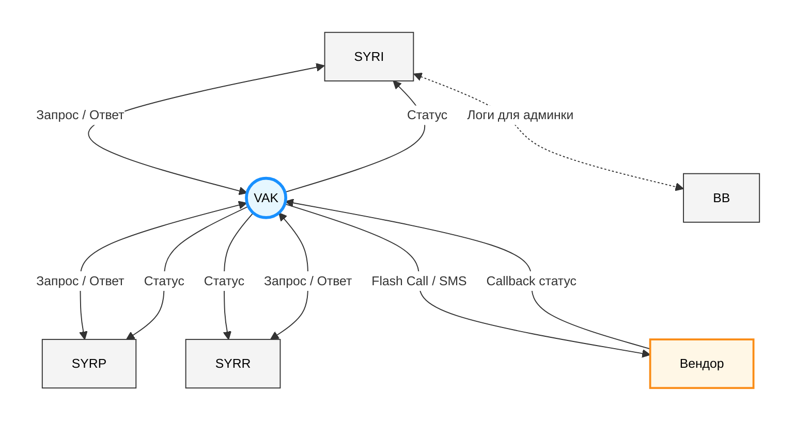

# Vision & Scope

## 1. Цель и область применения документа
Данный документ описывает цели и задачи проекта VAK, определяет границы проекта.

## 2. Бизнес-требования

### 2.1. Исходные данные (предпосылки)
В текущее время отправка аутентификационных сообщений имеет ряд ограничений:
*   имеет только один канал доставки сообщений на телефон пользователя - SMS;
*   подключен только один вендор, что приводит к его монополии:
    *   вендор может диктовать ценовую политику, невыгодную для компании;
    *   при недоступности вендора компания лишается возможности отправлять аутентификационные сообщения.

### 2.2. Бизнес-цели

| ID | Описание | Критерий успешного выполнения |
| :--- | :--- | :--- |
| **БЦ-1** | Снизить эксплуатационные расходы на доставку аутентификационных сообщений в 1,5-2 раза к 01.01.2026 г. | Через месяц после реализации MVP и интеграции с сервисами снизились расходы на доставку аутентификационных сообщений |
| **БЦ-2** | Повысить надежность доставки аутентификационных сообщений | Процент успешно доставленных аутентификационных сообщений по всем каналам увеличился |
| **БЦ-3** | Решить проблему монополии вендора | - |

#### 2.2.1. User Story 1 - Снижение стоимости доставки
| Роль | Детали |
| :--- | :--- |
| **Заказчик** | Бизнес |
| **Примечание** (Я хочу) | Использовать дополнительные каналы доставки аутентификационных сообщений по номеру мобильного телефона |
| **Цель** (Чтобы) | Снизить стоимость доставки |

#### 2.2.2. User Story 2 - Повышение надежности доставки
| Роль | Детали |
| :--- | :--- |
| **Заказчик** | Бизнес |
| **Примечание** (Я хочу) | Использовать альтернативные каналы доставки аутентификационных сообщений по номеру мобильного телефона |
| **Цель** (Чтобы) | Увеличить процент доставленных аутентификационных сообщений с 88% до 98% |

#### 2.2.3. User Story 3 - Повышение отказоустойчивости системы доставки
| Роль | Детали |
| :--- | :--- |
| **Заказчик** | Бизнес |
| **Примечание** (Я хочу) | Подключать новых вендоров |
| **Цель** (Чтобы) | Повысить отказоустойчивость системы доставки аутентификационных сообщений |

#### 2.2.4. User Story 4 - Снижение влияния фактора монополии вендора
| Роль | Детали |
| :--- | :--- |
| **Заказчик** | Бизнес |
| **Примечание** (Я хочу) | Подключать новых вендоров |
| **Цель** (Чтобы) | Выбирать ценовые условия |

#### 2.2.5. User Story 5 - Реагирование на изменения законодательства
| Роль | Детали |
| :--- | :--- |
| **Заказчик** | Бизнес |
| **Примечание** (Я хочу) | Подключать новых вендоров |
| **Цель** (Чтобы) | Быстро и гибко реагировать на изменение законодательства РФ и РБ |

### 2.3. Бизнес-правила

| ID | Описание | Комментарий |
| :--- | :--- | :--- |
| **БП-1** | Взаимодействие с внешними системами (вендорами) должно осуществляться по защищенным протоколам | |
| **БП-2** | В аутентификационных сообщениях должен быть указан отправитель - "`Название компании`" (если такая функция предусмотрена для используемого канала доставки) | |
| **БП-3** | К хранению персональных данных пользователей предъявляются общие требования по компании | Выполнение данного бизнес-правила необходимо только в случае фактического хранения персональных данных пользователей разрабатываемой системой |

### 2.4. Бизнес-риски

| ID | Описание | Вероятность возникновения* | Влияет на выполнение бизнес-цели | Последствия | Действия при возникновении (смягчение последствий) |
| :--- | :--- | :--- | :--- | :--- | :--- |
| **БР-1** | Изменение требований к масштабам и границам проекта | MEDIUM | [БЦ-1](#22-бизнес-цели) | Нарушение сроков выполнения проекта | - |
| **БР-2** | Изменение условий взаимодействия с вендором, которые будут невыгодны для компании и приведут к повышению затрат на доставку аутентификационных сообщений | MEDIUM | [БЦ-1](#22-бизнес-цели) | Невыполнение цели проекта по снижению затрат | - |
| **БР-3** | Превышение лимитов по сумме и/или сроку действия договора, в следствие чего должен будет проводиться тендер по ФЗ-223, который текущий вендор может не выиграть | MEDIUM | [БЦ-1, БЦ-3](#22-бизнес-цели) | Изменение требований к интеграции с другим вендором - нарушение сроков выполнения проекта | - |
| **БР-4** | Истечение срока действия договора, в следствие чего необходимо будет проводить тендер по ФЗ-223 | LOW | [БЦ-1, БЦ-3](#22-бизнес-цели) | Изменение требований к интеграции с другим вендором - нарушение сроков выполнения проекта | - |
| **БР-5** | Согласование операторами связи сообщений как маркетинговых, а не аутентификационных, что значительно повысит их стоимость | LOW | [БЦ-1](#22-бизнес-цели) | Невыполнение цели проекта по снижению затрат | Переговоры с вендором и пересмотр текста сообщений для удовлетворения условий операторов связи |
| **БР-6** | Разрабатываемое решение не решит задачу по снижению затрат на доставку аутентификационных сообщений | LOW | [БЦ-1](#22-бизнес-цели) | Невыполнение цели проекта по снижению затрат | Пересмотр список Use Cases, в рамках которых отправляются аутентификационные сообщения |
| **БР-7** | Изменение списка доступных каналов доставки в соответствии с законодательством РФ и РБ | LOW | [БЦ-1, БЦ-2](#22-бизнес-цели) | Изменение требований к интеграции - нарушение сроков выполнения проекта | - |
| **БР-8** | Отсутствие реализации интеграции со смежными сервисами компании по независящим от данного проекта причинам | MEDIUM | [БЦ-1](#22-бизнес-цели) | Невыполнение цели проекта по снижению затрат | Сформировать рабочую группу для помощи командам сервисов в плане интеграции с данным проектом |

> **Вероятность возникновения:**
> *   **HIGH** - высокая вероятность возникновения риска, существуют четкие предпосылки к его возникновению и/или он уже частично проявился;
> *   **MEDIUM** - средняя вероятность возникновения риска, существуют некоторые условия для его возникновения;
> *   **LOW** - низкая вероятность возникновения риска, может проявиться при стечении маловероятных обстоятельств.

---

## 3. Образ продукта (видение)

### 3.1. Концепция решения
VAK - система работы с альтернативными SMS способами доставки уведомлений на мобильные телефоны пользователей (далее - Система):
*   MobileID;
*   Flash Call,
*   Voice Call и т.д.

К Системе может быть подключен любой вендор в дополнение или вместо текущего.

### 3.2. Основные функции

| ID | Описание | Приоритет | Позволит реализовать цели | Комментарий |
| :--- | :--- | :--- | :--- | :--- |
| **ОФ-1** | Отправка аутентификационных сообщений пользователям посредством MobileID | BACKLOG | [БЦ-1](#22-бизнес-цели) | Приоритет изменен в соответствии с MFU 05.03.2025 |
| **ОФ-2** | Отправка аутентификационных сообщений пользователям посредством Flash Call | MVP | [БЦ-1](#22-бизнес-цели) | |
| **ОФ-3** | Определение способа доставки аутентификационных сообщений в зависимости от кода страны в номере телефона пользователя | MVP | [БЦ-2](#22-бизнес-цели) | |
| **ОФ-4** | Подключение нового вендора (заменяя или дополняя текущего) | SCOPE 1 | [БЦ-2, БЦ-3](#22-бизнес-цели) | При условии заключения компанией договора с новым вендором |
| **ОФ-5** | Отправка аутентификационных сообщений пользователям посредством SMS | SCOPE 1 | [БЦ-2](#22-бизнес-цели) | |
| **ОФ-6** | Каскадная отправка аутентификационных сообщений разными способами доставки - если не получилось доставить дополнительным способом, то должно быть отправлено SMS | SCOPE 2 | [БЦ-2](#22-бизнес-цели) | При условии, что самим вендором не предусмотрена услуга каскадной отправки |
| **ОФ-7** | Каскадная отправка аутентификационных сообщений разными вендорами - если не доступен основной вендор, то сообщение отправляется посредством дополнительного | SCOPE 2 | [БЦ-2](#22-бизнес-цели) | При условии подключения более одного вендора, доставляющего сообщения в один (общий для них) регион |

### 3.3. Предположения и зависимости

| ID | Описание |
| :--- | :--- |
| **ПЗ-1** | **Необходима интеграция SYRI с Системой** • для передачи данных, необходимых для отправки аутентификационных сообщений: &nbsp;&nbsp;◦ номер телефона пользователя, &nbsp;&nbsp;◦ код подтверждения (при необходимости), &nbsp;&nbsp;◦ текст аутентификационного сообщения (при необходимости); • для получения статуса доставки сообщения |
| **ПЗ-2** | **Необходима интеграция SYRR с Системой** • для передачи данных, необходимых для отправки аутентификационных сообщений: &nbsp;&nbsp;◦ номер телефона пользователя, &nbsp;&nbsp;◦ код подтверждения (при необходимости), &nbsp;&nbsp;◦ текст аутентификационного сообщения (при необходимости); • для получения статуса доставки сообщения |
| **ПЗ-3** | **Необходима интеграция SYRP с Системой** • для передачи данных, необходимых для отправки аутентификационных сообщений: &nbsp;&nbsp;◦ номер телефона пользователя, &nbsp;&nbsp;◦ код подтверждения (при необходимости), &nbsp;&nbsp;◦ текст аутентификационного сообщения (при необходимости); • для получения статуса доставки сообщения |
| **ПЗ-4** | **Система должна быть интегрирована с соответствующим вендором:** • для отправки аутентификационных сообщений пользователям; • для получения callback о статусе доставки |

---

## 4. Масштабы и ограничения проекта

### 4.1. Границы MVP-версии проекта

#### 4.1.1. Состав MVP-версии проекта
Информация о составе MVP отображена в разделе "Основные функции".

Для достижения [БЦ-1](#22-бизнес-цели) должна быть реализована интеграция хотя бы одного из сервисов SYRI, SYRR, SYRP с Системой. Интеграция предполагает отправку в VAK всех первичных запросов на доставку аутентификационного сообщения по номеру телефона; если VAK не смог доставить сообщение, необходимо воспользоваться текущей интеграцией с SYRC для отправки SMS.

При возникновении бизнес-рисков, объем MVP проекта может быть изменен в соответствии с таблицей:

| ID | Описание | Обоснование (влияющий бизнес-риск) |
| :--- | :--- | :--- |
| **1** | Возможен поэтапный ввод VAK, или ввод с неполным функционалом (только один альтернативный способ доставки сообщений, а не оба) | [БР-1, БР-7](#24-бизнес-риски) |

#### 4.1.2. Временные рамки выпуска MVP-версии проекта
MVP-версия проекта должна быть выпущена в `Production` до конца 2 квартала 2026 года.
Дорожная карта MVP-версии проекта отображена в _Roadmap MVP_.

### 4.2. Ограничения и исключения из объема проекта

| ID | Описание |
| :--- | :--- |
| **ОИ-1** | Система не генерирует коды подтверждения и не сверяет их на своей стороне |
| **ОИ-2** | Система не имеет шаблоны текста аутентификационных сообщений и не управляет ими |
| **ОИ-3** | Система не передает напрямую данные об отправке аутентификационных сообщений в BB для их отображения в административной панели (для службы поддержки). Все доработки BB, необходимые для поддержки интеграции сервисов SYRI, SYRR, SYRP с VAK, выходят за рамки данного проекта |
| **ОИ-4** | Система не может самостоятельно (без входящего запроса) инициировать отправку аутентификационных сообщений |
| **ОИ-5** | Система самостоятельно не запрашивает номера телефонов пользователей |
| **ОИ-6** | Система не интегрируется с SYRC |
| **ОИ-7** | Система не может подключать новых вендоров посредством изменения только конфигурационных файлов |

---

## 5. Бизнес-контекст

### 5.1. Контекстная диаграмма
*Context diagram (контекстная диаграмма) - аналитическая модель, которая описывает абстрактную систему высокого уровня. Контекстная диаграмма определяет внешние для системы объекты, которые взаимодействуют с ней, но не отображает ничего из внутренней структуры или поведения системы.*

> [!NOTE]
> На схему в качестве исключения добавлен сервис BB, напрямую не взаимодействующий с системой (VAK), но на который влияет реализуемый системой функционал (в части отображения в административной панели логов аутентификационных сообщений).

### 5.2. Заинтересованные стороны
В таблице ниже указаны заинтересованные в реализации описываемого проекта стороны: другие проекты/сервисы и контактные лица по ним.

| Проект / Сервис | Контактные лица | Степень вовлеченности (RACI*) | Предмет интереса | Комментарий |
| :--- | :--- | :--- | :--- | :--- |
| **SYRI** | email | R, C | [ОФ-1, ОФ-2, ОФ-4, ОФ-5](#32-основные-функции) | Интеграция с VAK в рамках реализации функционала "Авторизация по номеру телефона" |
| **SYRR** | email | R, C | [ОФ-1, ОФ-2, ОФ-4, ОФ-5](#32-основные-функции) | Интеграция с VAK в рамках реализации функционала "Регистрация по номеру телефона" |
| **SYRP** | email | R, C | [ОФ-1, ОФ-2, ОФ-4, ОФ-5](#32-основные-функции) | - |
| **BB** | email | I | [ОФ-1, ОФ-2](#32-основные-функции) | - |

> #### * RACI:
> *   **R (Responsible)** - несет ответственность за выполнение задачи;
> *   **A (Accountable)** - будет привлечен к ответственности в случае невыполнения задачи и может руководить лицом, ответственным за ее выполнение (эту роль часто выполняют менеджеры проектов);
> *   **C (Consulted)** - не несет прямую ответственность за выполнение проекта, но консультирует по ее различным аспектам;
> *   **I (Informed)** - проинформирован, но не несет ответственности за задачи.
